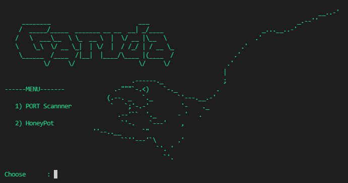

# About Tool :

It is a combination of Network Port Scanner and Honeypot.
* Scanner is used to scan IP addresses, and discover hosts and services on a computer network by sending packets and analyzing the responses.
* Low-interaction honeypot simply captures connection attempts and alerts you an intrusion has been attempted to your system. 

## Available And Tested On:
* Windows
* Linux (coming soon)

## Featues :
* [+] Port Scanning 
* [+] Honeypot 
* [+] Easy for Beginners 

## How to use :
* git clone https://github.com/EFFLUX110/garuda.git
* cd garuda
* python3 garuda.py

## Screenshot :

  
## **WARNING :**
***This tool is only for educational purpose. If you use this tool for other purposes except education we will not be responsible in such cases.***

  
